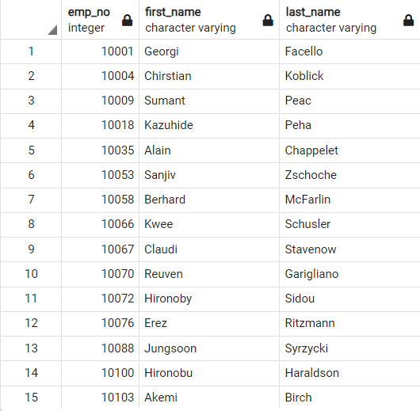
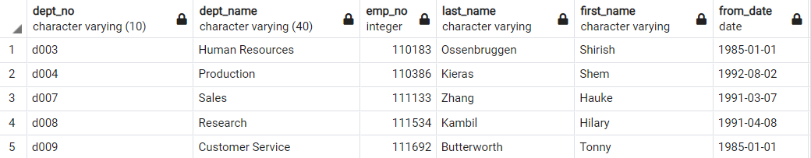
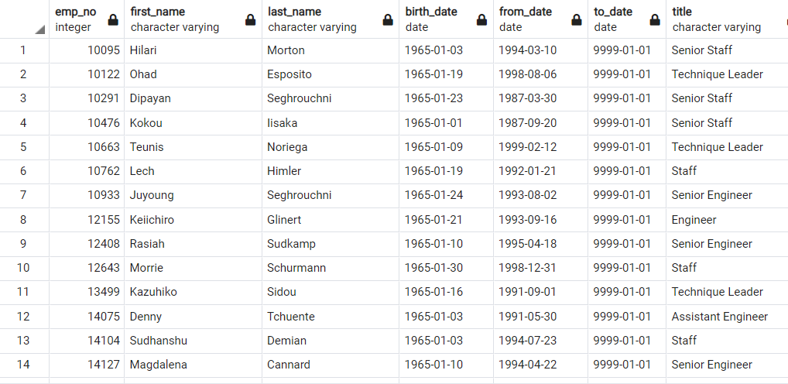

# Pewlett-Hackard-Analysis Overview
  We determine the number of retiring employees per title, and identify employees who are eligible to participate in a mentorship program. 
## Results
	Help prepare for a "silver tsunami" as many current employees reach retirement age by using the ERD we created in the module as a reference to our knowledge of SQL queries.
### Summary
  How many roles will need to be filled as the "silver tsunami" begins to make an impact? see retirement info below 
  Are there enough qualified, retirement-ready employees in the departments to mentor the next generation of Pewlett Hackard employees? see preparing for  managers preparing for retirement and mentorship eligibility
# Managers preparing for retirement

# Mentorship eligibility

